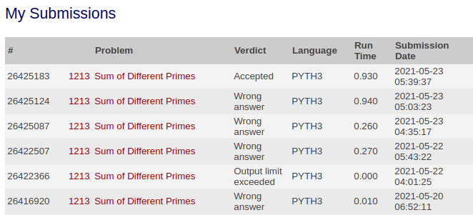
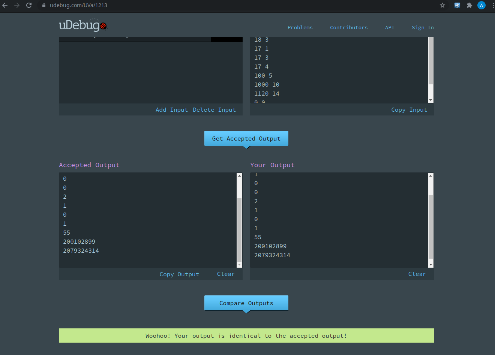

# Solution - Sum of Different Primes
###  01213 – Sum of Different Primes

O problema recebeu veredito "Accepted", pelo Online Judge como mostrado na figura abaixo:

O programa também produz as respostas de forma correta e recebeu aprovação do uDebug:

